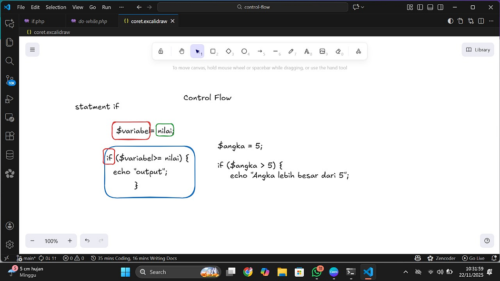
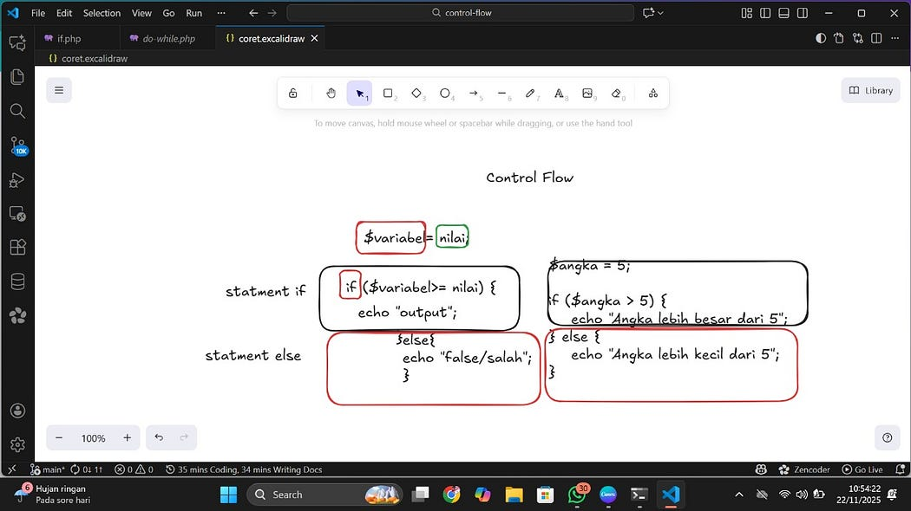
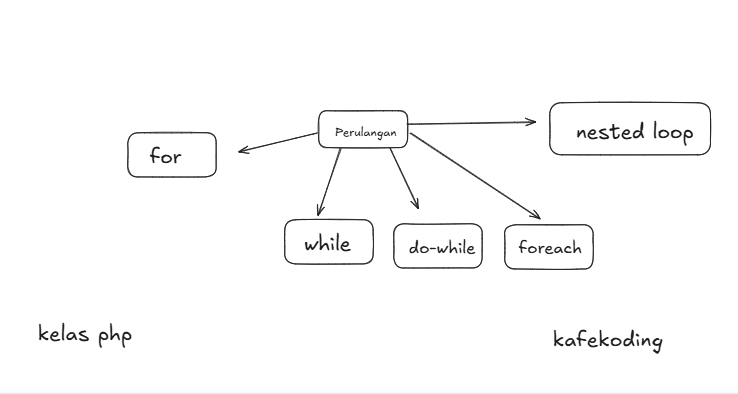
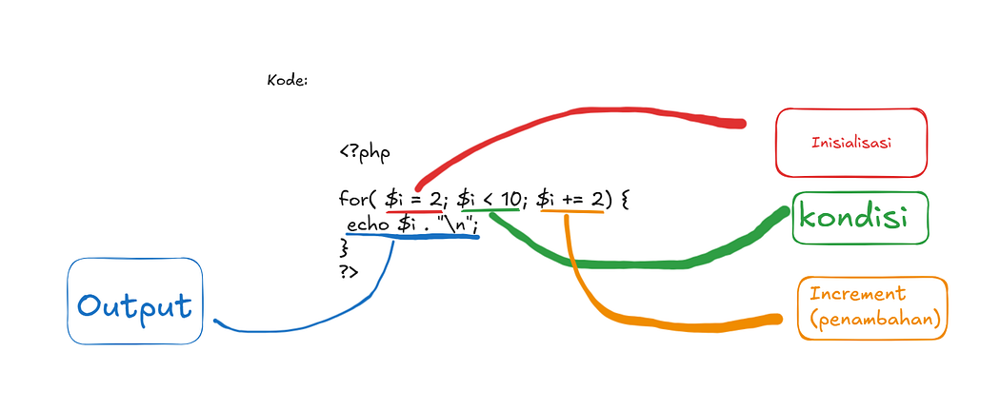
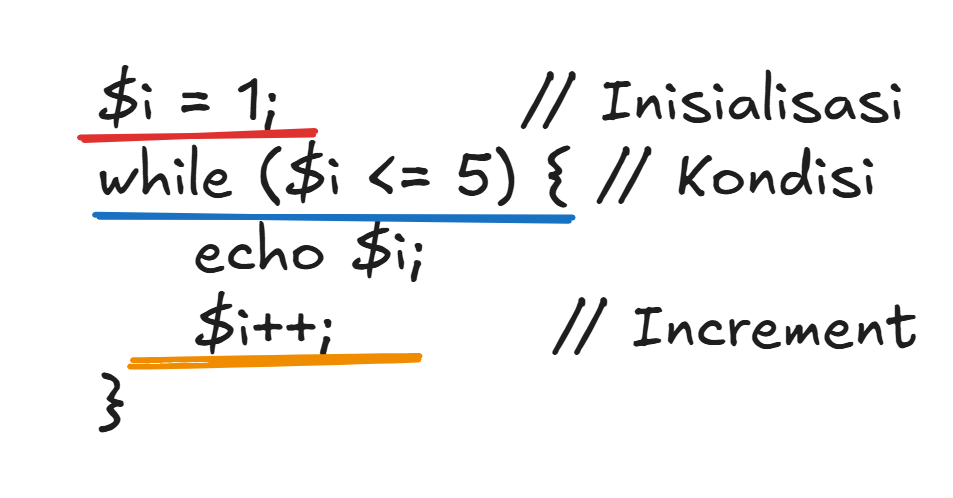
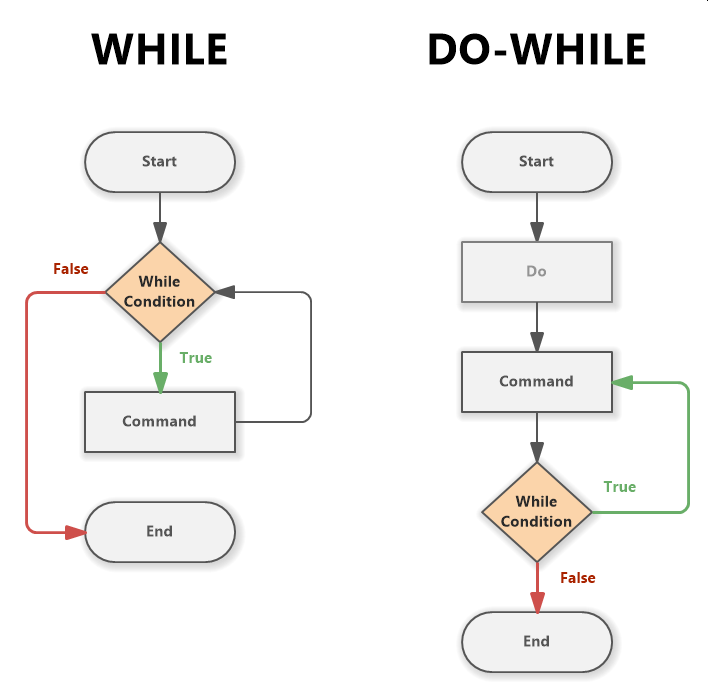
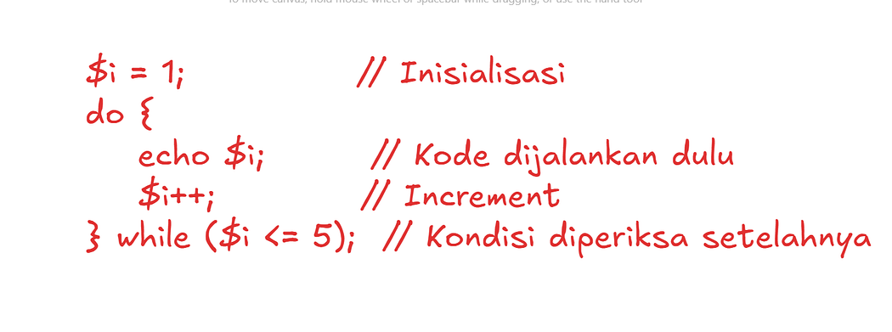

# Control Flow dalam PHP


## Apa itu Control Flow?

**Control flow** dalam PHP adalah _cara program menentukan urutan langkah yang harus dijalankan_, apakah harus lanjut, berhenti, memilih jalur tertentu, atau mengulang langkah yang sama. Program tidak selalu berjalan lurus dari atas ke bawah, kadang harus mengecek kondisi dulu sebelum memutuskan langkah berikutnya.

### Analogi

Bayangkan ada **polisi lalu lintas** di sebuah persimpangan. Dia melihat situasi jalan: apakah ramai, sepi, atau ada kendaraan dari arah tertentu. Berdasarkan kondisi itu, polisi memutuskan:
- kendaraan **boleh maju**
- **berhenti dulu**
- **belok ke kanan**
- atau **putar balik**

Nah, **PHP pun seperti itu** — sebelum menjalankan baris kode tertentu, dia "melihat situasi" (kondisi), lalu memilih jalur mana yang harus dilalui oleh program.

Jadi, **control flow** adalah mekanisme yang membuat program tidak berjalan lurus seperti membaca paragraf, tetapi **menyesuaikan alurnya sesuai kondisi yang terjadi** pada saat program berjalan. Control flow = _mesin pengambil keputusan_ di dalam PHP.

---

## 1. Pencabangan (Conditional Statements)

Pencabangan adalah fitur dalam PHP yang membuat program **memilih satu jalur kode** berdasarkan kondisi tertentu. Ibarat polisi lalu lintas di pertigaan, PHP melihat situasi dulu baru menentukan apakah harus **jalan**, **berhenti**, atau **ambil jalur lain**.

### a. IF

`if` adalah kondisi utama. PHP hanya menjalankan kode di dalam `if` **jika kondisi bernilai true**.

**Analogi:** Polisi bilang: _"Kalau jalan sepi, silakan maju."_ Kalau tidak sepi, ya tidak maju.

Secara konsep, `if` bekerja seperti berikut:
- **Ada sebuah variabel** → berisi suatu nilai.
- **Ada kondisi yang dicek** → misalnya apakah nilai tersebut lebih besar dari angka tertentu.
- Jika kondisi itu benar → **kode di dalam `{}` akan dieksekusi**.
- Jika kondisi salah → kode tersebut **dilewati**.

**Gambar Ilustrasi:**



**Contoh:**

```php
<?php
$angka = 5;
if ($angka > 5) {
    echo "Angka lebih besar dari 5";
}
// Tidak ada output, karena $angka = 5, bukan > 5
?>
```

### b. ELSE

Setelah memahami bagaimana `if` bekerja untuk mengecek suatu kondisi, langkah berikutnya adalah mengenal `else`.

Dengan kata lain:
- `if` → dijalankan **jika kondisi benar**
- `else` → dijalankan **jika kondisi pada if salah**

Ini membuat alur program lebih lengkap, karena apapun hasil pengecekannya, PHP tetap tahu perintah mana yang harus dijalankan.

**Gambar Ilustrasi:**



**Contoh:**

```php
<?php
$angka = 5;
if ($angka > 5) {
    echo "Angka lebih besar dari 5";
} else {
    echo "Angka lebih kecil dari atau sama dengan 5";
}
// Output: Angka lebih kecil dari atau sama dengan 5
?>
```

### c. ELSE IF

`else if` digunakan ketika kita ingin menambahkan **pilihan kondisi lain** selain kondisi utama pada `if`.

Dengan `else if`, program bisa membuat keputusan yang lebih spesifik, tidak hanya benar atau salah, tetapi juga **kondisi tambahan di tengah-tengah**.

**Penting:** `else if` harus berada **di antara `if` dan `else`**. Tidak boleh berada di bawah `else` karena `else` adalah bagian penutup.

**Struktur yang benar:**

```php
if (kondisi1) {
    // kode
} else if (kondisi2) {
    // kode
} else {
    // kode
}
```

**Struktur yang salah:**

```php
if (...) { }
else { }
else if (...) { }  // ❌ Tidak boleh — PHP error
```

**Contoh:**

```php
<?php
$angka = 5;
if ($angka > 5) {
    echo "Angka lebih besar dari 5";
} else if ($angka == 5) {
    echo "Angka sama dengan 5";
} else {
    echo "Angka lebih kecil dari 5";
}
// Output: Angka sama dengan 5
?>
```

**Penjelasan alurnya:**
1. PHP cek kondisi pertama: `$angka > 5` → **false**
2. Lalu cek kondisi kedua: `$angka == 5` → **true**, maka blok ini dijalankan.
3. Karena sudah menemukan kondisi yang benar, PHP tidak mengecek else selanjutnya.

**Intinya:**
- `if` → kondisi utama
- `else if` → kondisi tambahan
- `else` → kondisi terakhir ketika semua kondisi gagal
- `else if` **wajib berada di antara** `if` dan `else`

### d. SWITCH

Selain menggunakan `if`, `else if`, dan `else`, PHP juga menyediakan cara lain untuk menangani banyak kondisi, yaitu `switch`.

`switch` digunakan ketika kita ingin **memeriksa satu variabel** terhadap **banyak kemungkinan nilai**.

Secara konsep, `switch` mirip seperti polisi yang mengarahkan kendaraan berdasarkan jenisnya:
- Kalau motor → jalur kiri
- Kalau mobil → jalur kanan
- Kalau truk → jalur lurus
- Selain itu → jalur umum

Dengan `switch`, kode lebih rapi dan mudah dibaca saat kondisi yang diperiksa **bentuknya satu variabel dengan beberapa nilai berbeda**.

**Struktur Dasar:**

```php
switch ($variabel) {
    case nilai1:
        // kode
        break;
    case nilai2:
        // kode
        break;
    default:
        // kode jika tidak ada yang cocok
}
```

Penjelasan:
- **case** → seperti "jika nilainya sama dengan …"
- **break** → untuk menghentikan pemeriksaan agar tidak lanjut ke case lain
- **default** → mirip `else`, dijalankan jika tidak ada case yang cocok

**Contoh:**

```php
<?php
$hari = "Senin";
switch ($hari) {
    case "Senin":
        echo "Hari pertama kerja";
        break;
    case "Sabtu":
        echo "Libur setengah hari";
        break;
    case "Minggu":
        echo "Hari libur";
        break;
    default:
        echo "Hari biasa";
}
// Output: Hari pertama kerja
?>
```

**Cara kerjanya:**
1. PHP membaca nilai `$hari`
2. Mencocokkannya dengan setiap **case**
3. Ketika menemukan case yang cocok, PHP menjalankan aksi tersebut
4. `break` menghentikan proses agar tidak lanjut ke case lain
5. Jika tidak ada yang cocok, PHP menjalankan bagian **default**

**Kapan pakai switch?**

Gunakan `switch` ketika:
- Kamu mengecek **satu variabel** dengan **beberapa kemungkinan nilai**
- Kondisinya **tidak kompleks**, hanya membandingkan kesamaan nilai
- Kamu ingin tampilan kode lebih rapi daripada banyak `else if`

---

## 2. Perulangan (Loop)

Berbeda dengan percabangan yang hanya memilih satu jalur eksekusi, perulangan digunakan untuk menjalankan kode yang sama secara berulang, baik dengan jumlah yang sudah ditentukan maupun selama kondisi tertentu masih terpenuhi.

**Jenis-jenis Perulangan pada PHP:**



### a. FOR Loop

Perulangan `for` adalah metode paling terstruktur untuk membuat loop ketika kita sudah mengetahui jumlah iterasi yang dibutuhkan.

**Gambar Ilustrasi FOR Loop:**



**Struktur dasar `for` terdiri dari tiga bagian utama:**
1. **Inisialisasi** - Mendefinisikan nilai awal variabel penghitung
2. **Kondisi** - Menentukan kapan perulangan harus berhenti
3. **Increment/Decrement** - Mengatur perubahan nilai pada setiap iterasi

**Sintaks:**

```php
for (inisialisasi; kondisi; increment) {
    // kode yang diulang
}
```

**Penjelasan:**

**1. Inisialisasi** (contoh: `$i = 2`)
- Bagian pertama dari `for` adalah tempat kita mendefinisikan **nilai awal** dari variabel penghitung (counter).
- Inisialisasi hanya dijalankan **sekali** di awal sebelum loop dimulai.

**2. Kondisi** (contoh: `$i < 10`)
- Kondisi inilah yang menentukan apakah perulangan **boleh dilanjutkan** atau harus **berhenti**.
- Jika kondisi **true**, maka blok kode di dalam `{ ... }` akan dijalankan.
- Jika kondisi **false**, loop akan berhenti.

**3. Increment/Decrement** (contoh: `$i += 2`)
- Bagian ketiga adalah perubahan nilai variabel setiap kali satu siklus perulangan selesai.
- Ini memastikan loop **maju** menuju kondisi berhenti.
- Jika bagian ini tidak ada atau salah, loop bisa menjadi **infinite loop** (tidak pernah selesai).

**Contoh:**

```php
<?php
// Menampilkan angka 1-10
for ($i = 1; $i <= 10; $i++) {
    echo $i . " ";
}
// Output: 1 2 3 4 5 6 7 8 9 10

// Menampilkan angka genap
for ($i = 2; $i <= 20; $i += 2) {
    echo $i . " ";
}
// Output: 2 4 6 8 10 12 14 16 18 20

// Countdown
for ($i = 10; $i >= 1; $i--) {
    echo $i . " ";
}
// Output: 10 9 8 7 6 5 4 3 2 1
?>
```

### b. WHILE Loop

Kalau pada `for` kita sudah menentukan **mulai – syarat – langkah**, maka pada **while**, fokus utamanya hanya **kondisi**.

Loop akan terus berjalan **selama kondisi bernilai true**.

**Gambar Ilustrasi WHILE Loop:**



**Sintaks:**

```php
while (kondisi) {
    // kode yang diulang
}
```

**Penjelasan:**

**1. Inisialisasi**
```php
$i = 1;
```
Kita tentukan **angka mulai**. Dalam contoh ini, `$i` dimulai dari **1**.

**2. Kondisi**
```php
while ($i <= 5)
```
Artinya: _"Selama `$i` masih kurang dari atau sama dengan 5, ulangi terus kodenya."_
- Kalau kondisi **true**, loop berjalan.
- Kalau **false**, loop berhenti.

**3. Increment**
```php
$i++;
```
Setiap perulangan selesai, nilai `$i` **bertambah 1**. Tujuannya supaya perulangan **bergerak menuju berhenti**, tidak muter terus.

**Contoh:**

```php
<?php
// Menampilkan angka 1-5
$i = 1;
while ($i <= 5) {
    echo $i;
    $i++;
}
// Output: 1 2 3 4 5

// Penjelasan:
// - Mulai dari 1
// - Dicek: "1 ≤ 5?" → YA → cetak
// - Naik jadi 2
// - Dicek lagi → YA → cetak
// - Terus sampai 5
// - Saat $i jadi 6, dicek: "6 ≤ 5?" → TIDAK → perulangan berhenti
?>
```

### c. DO-WHILE Loop

`do...while` mirip dengan `while`, tetapi memiliki **satu perbedaan penting**:

> **Kode di dalam `do` akan dijalankan minimal sekali, meskipun kondisi sebenarnya false.**

Artinya, `do...while` cocok dipakai ketika kamu ingin **menjalankan suatu aksi dulu**, baru setelah itu mengecek kondisinya.

**Perbandingan Flowchart WHILE vs DO-WHILE:**



**Sintaks:**

```php
do {
    // kode yang diulang
} while (kondisi);
```

**Gambar Ilustrasi DO-WHILE di PHP:**



**Penjelasan:**

**1. Inisialisasi**
```php
$i = 1;
```
Kita mulai dari angka 1.

**2. Bagian `do` (Dijalankan dulu!)**
```php
do {
    echo $i;
    $i++;
}
```
Bagian ini **langsung dijalankan**, tanpa tanya-tanya dulu. Makanya `do...while` beda dari `while`.

**3. Kondisi**
```php
while ($i <= 5);
```
Setelah satu putaran selesai, baru dicek: _"Apakah `$i` masih ≤ 5?"_
- Jika **iya**, ulangi lagi do-block.
- Jika **tidak**, perulangan berhenti.

**Contoh:**

```php
<?php
// Perbedaan while vs do-while

// WHILE - tidak dijalankan jika kondisi false
$i = 10;
while ($i < 5) {
    echo $i;  // Tidak tampil
}

// DO-WHILE - dijalankan minimal 1x
$i = 10;
do {
    echo $i;  // Tampil: 10
} while ($i < 5);
?>
```

**Bedanya dengan `while`:**

Dengan `while`, jika kondisi awal salah, kode tidak akan pernah berjalan. Tapi dengan `do...while`, kode **selalu jalan dulu**, meski kondisi akhirnya false.

Analoginya:
- `while` = **"Cek dulu, baru lakukan."**
- `do...while` = **"Lakukan dulu, baru cek."**

### d. FOREACH Loop

Khusus untuk iterasi array.

**Sintaks:**

```php
foreach ($array as $value) {
    // kode
}

// atau dengan key
foreach ($array as $key => $value) {
    // kode
}
```

**Contoh:**

```php
<?php
// Array indexed
$buah = ["Apel", "Jeruk", "Mangga", "Pisang"];

foreach ($buah as $item) {
    echo $item . "<br>";
}
// Output:
// Apel
// Jeruk
// Mangga
// Pisang

// Dengan index
foreach ($buah as $index => $item) {
    echo ($index + 1) . ". $item<br>";
}
// Output:
// 1. Apel
// 2. Jeruk
// 3. Mangga
// 4. Pisang

// Array associative
$siswa = [
    "nama" => "Budi",
    "umur" => 20,
    "kelas" => "PHP"
];

foreach ($siswa as $key => $value) {
    echo "$key: $value<br>";
}
// Output:
// nama: Budi
// umur: 20
// kelas: PHP
?>
```

---

## Break dan Continue

### BREAK

Menghentikan loop sepenuhnya.

```php
<?php
for ($i = 1; $i <= 10; $i++) {
    if ($i == 5) {
        break;  // Stop di 5
    }
    echo $i . " ";
}
// Output: 1 2 3 4
?>
```

### CONTINUE

Melewati iterasi saat ini dan lanjut ke iterasi berikutnya.

```php
<?php
for ($i = 1; $i <= 10; $i++) {
    if ($i % 2 == 0) {
        continue;  // Skip angka genap
    }
    echo $i . " ";
}
// Output: 1 3 5 7 9
?>
```

---

## Nested Loop

Loop di dalam loop.

```php
<?php
// Tabel perkalian
for ($i = 1; $i <= 5; $i++) {
    for ($j = 1; $j <= 5; $j++) {
        echo ($i * $j) . "\t";
    }
    echo "<br>";
}

// Output:
// 1  2  3  4  5
// 2  4  6  8  10
// 3  6  9  12 15
// 4  8  12 16 20
// 5  10 15 20 25

// Pola bintang
for ($i = 1; $i <= 5; $i++) {
    for ($j = 1; $j <= $i; $j++) {
        echo "* ";
    }
    echo "<br>";
}

// Output:
// *
// * *
// * * *
// * * * *
// * * * * *
?>
```

---

## Contoh Praktis

### 1. Daftar Produk dengan Harga

```php
<?php
$produk = [
    ["nama" => "Laptop", "harga" => 5000000],
    ["nama" => "Mouse", "harga" => 50000],
    ["nama" => "Keyboard", "harga" => 150000],
    ["nama" => "Monitor", "harga" => 2000000]
];

echo "<h3>Daftar Produk</h3>";
echo "<table border='1' cellpadding='10'>";
echo "<tr><th>No</th><th>Nama</th><th>Harga</th></tr>";

$no = 1;
foreach ($produk as $item) {
    echo "<tr>";
    echo "<td>$no</td>";
    echo "<td>{$item['nama']}</td>";
    echo "<td>Rp " . number_format($item['harga'], 0, ',', '.') . "</td>";
    echo "</tr>";
    $no++;
}

echo "</table>";
?>
```

### 2. Validasi Login (Simulasi)

```php
<?php
$username_benar = "admin";
$password_benar = "rahasia";
$max_attempt = 3;

for ($attempt = 1; $attempt <= $max_attempt; $attempt++) {
    echo "Percobaan ke-$attempt<br>";
    
    // Simulasi input
    $username = "admin";
    $password = ($attempt == 2) ? "rahasia" : "salah";
    
    if ($username == $username_benar && $password == $password_benar) {
        echo "Login berhasil!<br>";
        break;
    } else {
        echo "Username atau password salah!<br>";
        
        if ($attempt == $max_attempt) {
            echo "Akun diblokir!<br>";
        }
    }
}
?>
```

### 3. Hitung Rata-rata Nilai

```php
<?php
$nilai = [85, 90, 78, 92, 88];

$total = 0;
$jumlah = count($nilai);

foreach ($nilai as $n) {
    $total += $n;
}

$rata = $total / $jumlah;

echo "Nilai: " . implode(", ", $nilai) . "<br>";
echo "Total: $total<br>";
echo "Rata-rata: $rata<br>";

if ($rata >= 80) {
    echo "Predikat: Sangat Baik";
} elseif ($rata >= 70) {
    echo "Predikat: Baik";
} else {
    echo "Predikat: Cukup";
}
?>
```

---

## Kesimpulan

Anda telah mempelajari Control Flow di PHP:
- **Percabangan**: if, else, elseif, switch
- **Perulangan**: for, while, do-while, foreach
- **Kontrol**: break, continue
- **Nested**: loop di dalam loop

Selanjutnya kita akan belajar tentang Array dan Function!
